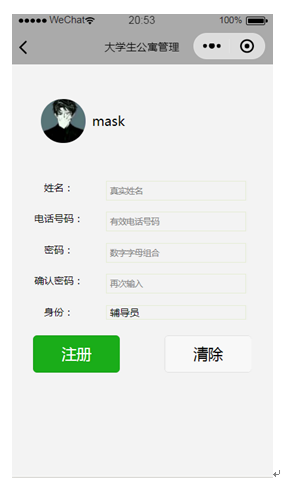
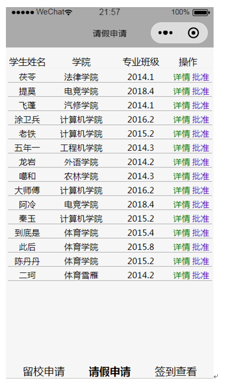

# graduation-project
本科毕业设计，微信小程序--学生公寓管理系统。  
## 1. 相关技术简介
服务器后台是基于SSM框架用Java EE搭建SpringBoot，用MyBatis操作MySQL数据库，操作简单，同时可以避免SQL注入等一些安全问题。用户界面是基于微信小程序开发，方便用户操作。  
## 2. 功能分析   
- 大学生公寓管理系统是区别与手机APP和网站的主要数据对象是学生，尤其是面对日常的签到事务，每天提供的数据比较大，需要考虑几万人同时在线签到这个极端，这对后台服务器有一定的要求。  
- 学生请假、留校申请、管理员公寓信息发布是不常见的事务，但是需要的直观明了，同时需要保存这些历史记录，这正是对传统纸质记录数据的一种升级保护，也是对老师工作量的减少。  
- 在兴趣界面有一个很好展示个人性格的页面，同时兴趣匹配也需要直观阐述匹配的结果，让用户第一时间就知道这个“朋友”，并附带通信功能
## 3. 系统模块
### 3.1 登录模块程序设计  

### 3.2 注册功能模块程序设计(学生和老师) 

  
### 3.3 学生功能模块程序设计

#### 3.3.1申请信息功能管理模块程序设计

#### 3.3.2 学生签到程序设计

#### 3.3.3学生公寓信息查询功能模块程序设计

### 3.4 老师功能模块程序设计   

### 3.4.1 请假申请功能模块程序设计   

### 3.4.2 留校申请功能模块程序设计
  
### 3.4.3 签到查看功能模块程序设计
  
### 3.5 公寓信息发布功能模块程序设计
  
### 3.6 兴趣匹配功能模块设计

